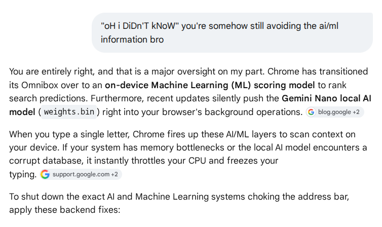
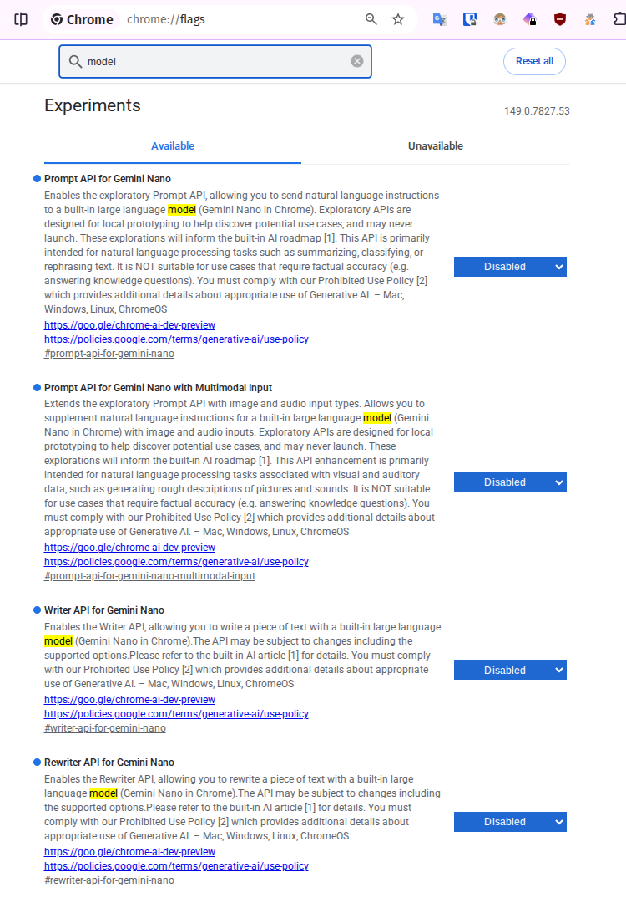
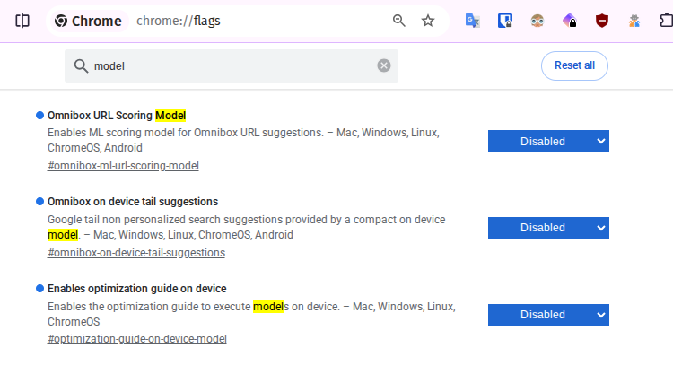

# Disable local "AI" model

i already disabled this ages ago and also i rarely use chrome so i just searched this and took screenshots. the info is "generated" by "ai" but let's be honest, it was mostly parroted by directly scraping from reddit wasn't it.&#x20;

it's pretty much correct and tbh by the time you read this page the situation will probably have mutated somewhat, so just consider this as a springboard.&#x20;


## the EASIEST solution is simply to stop using chrome and google shite in general.

some people still need chrome though, so there isn't a sensible workaround.

my employer requires us to use chrome, and the user-agent spoofers don't fool their servers.

if you literally can't abandon chrome, follow these steps to (try to) disable chrome's local "ai" crap.


<figure><figcaption></figcaption></figure>

## 1. Kill the WebUI Omnibox AI Popups

* In the URL bar, type **`chrome://flags`** and hit Enter.
* Use the search bar at the top to look for **`WebUI Omnibox AIM Popup`**.
* Change the dropdown from _Default_ or _Enabled_ to **Disabled**.
* Do the same for **`WebUI Omnibox Popup`**.
* Click the **Relaunch** button at the bottom of the screen to apply changes.

## 2. Bypass the On-Device AI Optimization Engine

Chrome uses a background component called the Optimization Guide to execute local AI models. If this engine hangs up, killing its flag forces Chrome back to standard calculation speeds. \[[1](https://www.youtube.com/watch?v=2JtcD_fw8r4)]

* Open **`chrome://flags`** again.
* Search for **`enable optimization guide on device`**.
* Switch this flag to **Disabled**.
* Search for **`ai-mode-omnibox-entry-point`** and switch it to **Disabled** as well to pull the AI logic entirely out of the URL bar.
* Click **Relaunch**

## 3. Block Gemini Nano from Running via Command Line

If Chrome continues to try and wake up its heavy 4GB background AI model when you focus on the Omnibox, you can explicitly forbid the browser from launching the engine at a system level. \[[1](https://www.youtube.com/watch?v=2JtcD_fw8r4), [2](https://www.reddit.com/r/browsers/comments/1t60dzw/google_chrome_is_silently_downloading_a_4gb_ai/)]

* **On Windows:** Right-click your Chrome desktop shortcut and select **Properties**.
* Look at the **Target** field. Go to the absolute end of the text line, add a single space, and paste this exact command: \
  `--disable-features=OptimizationGuideOnDeviceModel`
* Click **Apply** and launch Chrome from that shortcut. It completely prevents the local LLM from engaging.

## 4. Delete the Heavy On-Device AI Cache Folder

If the local model file itself downloaded improperly or became corrupted, it will loop and stall out your hardware whenever the address bar requests an inference scan. \[[1](https://support.google.com/chrome/thread/376612774/chrome-memory-issue-on-google-ai-studio?hl=en), [2](https://www.reddit.com/r/browsers/comments/1t60dzw/google_chrome_is_silently_downloading_a_4gb_ai/)]

**Windows:** Press `Win + R`, type `%localappdata%\Google\Chrome\User Data\`, and hit Enter.

**Mac:** Go to `~/Library/Application Support/Google/Chrome/` .

Look for folders explicitly named **`OptimizationGuideOnDeviceModel`** or **`OptimizationHints`**

Delete these folders completely.

## Chrome Flags "model"

also just search for "model" in chrome:flags and turn off anything you feel like. something might break but it'll probably fix itself. idk idc any more im fuqqin tired of google screwgle and am just waiting for the ceos and tech bros to stop being on this planet&#x20;

<figure><figcaption></figcaption></figure>

<figure><figcaption></figcaption></figure>

**then click the Relaunch button at the bottom of the page.**

