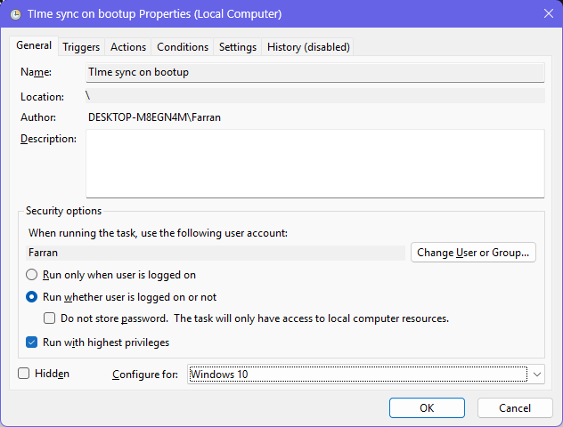

# Set Processor Affinity

Limit the number of CPU cores that the offending process/es have access to. This can be achieved from inside Windows Task Manager.

This is the safest option for you to use because it is a feature built into Windows, and it doesn't alter any hardware configurations.

It is relatively simple to achieve this.

## Open Task Manager

Open the Task Manager with `Ctrl`+`Shift`+`Esc` and switch to the Details tab:

<figure><picture><source srcset="../../../.gitbook/assets/image_2025-03-27_103619534.png" media="(prefers-color-scheme: dark)"></picture><figcaption></figcaption></figure>

## Find the process

### in Windows Task Manager

Click the CPU column header to sort the process list by CPU usage, to see the highest CPU usage at the top. The items in the list will jump around a lot. Hold the `Ctrl` key to pause the updating so that you can read and click on items.

Find the process (or processes) with the highest CPU usage. It is likely that these processes are responsible for over-using the CPU cores and thus are causing the CPU to slow down.

<figure><picture><source srcset="../../../.gitbook/assets/image_2025-03-27_104132796.png" media="(prefers-color-scheme: dark)"></picture><figcaption></figcaption></figure>

### in browser's task manager

You can also look in the task manager of your web browser — most modern web browsers have this function now. In most Chromium-based browsers, you can access it with `Shift`+`Esc`, or look in the main menu for something like `Developer Tools` → `Task Manager`. In this browser task manager, again sort the processes by CPU usage, and look for the processes which have high usage and are handling the video call. You may even find that the offending process is _not_ related to the video call! There are some very poorly-designed websites nowadays, which absolutely rag the CPU and GPU for no good reason.

### with PID / process ID

When you find the offending process/es, look in the Process ID column. (You might have to make the column visible: right click on the list header row and choose to add it.) The **Process ID** is the same as **PID** in Windows Task Manager.

Back in Windows Task Manager, find the process with the same PID.

## Set affinity

Now that you've selected the process that you want to restrict, hold `Ctrl` (to stop the list jumping around), right click on the process, and choose `Set affinity`.

<figure><picture><source srcset="../../../.gitbook/assets/image_2025-03-27_110254060.png" media="(prefers-color-scheme: dark)"></picture><figcaption></figcaption></figure>

In the window that pops up, you can set which CPU cores the process has access to:

<figure><picture><source srcset="../../../.gitbook/assets/image_2025-03-27_110813337.png" media="(prefers-color-scheme: dark)"></picture><figcaption></figcaption></figure>

## How many CPU cores?

Consider how much CPU the process needs to use. If it is a somewhat heavy process, or requires real-time processing (such as processing or streaming video & audio), you should probably designate it more than one CPU core. I gave it two.

If you're doing this with more than one process, consider how much CPU they each need to use, and dish out the CPU cores accordingly. In my use-case, the webpage uses high CPU, and so does the video streaming process. My laptop has 4 physical cores and 8 threads, and the computer sees each thread as if it were a core, so the Task Manager displays 8 cores. I give the webpage process 2 cores and the video streaming process 2 other cores.&#x20;

Note that Windows will still use those cores for other things too — we are only restricting the CPU core access of these processes so that they can't use every core willy-nilly.

## Check the CPU usage

Keep an eye on the process graphs tab in Task Manager after setting the process affinity. You should notice a difference. This is my CPU usage graphs after setting processor affinity for the video call-related processes:

<figure><picture><source srcset="../../../.gitbook/assets/image_2025-03-27_112641396.png" media="(prefers-color-scheme: dark)"></picture><figcaption></figcaption></figure>

Notice how the heaviest usage is now limited to only the first 2 CPU cores.

Notice also how the CPU clock speed is over 2 GHz. When all 8 cores were being used heavily by the video call processes, the clock speed got trapped below 1.8 GHz.&#x20;

***

If this doesn't work, you can try the other two solutions. Remember that they carry more risk!


## <mark style="color:red;">YOU HAVE BEEN WARNED!!!</mark>

&#x20;[Power User](https://app.gitbook.com/o/HGV4O8QFvR73oXn7Uxww/s/qA7gVdU3GXPI3OOuI1Ep/ "mention") (main site)

  → Solution 2: Limit CPU percentage (low-risk)&#x20;

  → Solution 3: Raise CPU thresholds (high-risk)&#x20;

