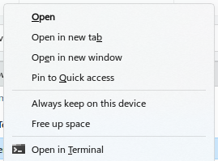

# Cloud file storage

First of all, you have to understand that _**we can never trust companies with our data**_.

This is a fundamental concept to live by in [Personal OPSEC](https://duckduckgo.com/?q=personal+opsec). 

This means that we can ONLY EVER TRUST solutions which provide "**zero-knowledge encryption**".

_Zero-knowledge_ means that your data is encrypted with _your own encryption key_ **before** it leaves your machine. That way, ~~if~~ _**WHEN**_ the host company is forced to give up your data, _they actually cannot_.

There are many solutions available, _**be sure to check for zero-knowledge encryption**_ — although, actually, there are also applications available which provide local encryption for your files before you upload them to _any_ service. Rclone is one of them, as is S3 Sync. 

You should also know that "AI" is already able to crack 56-bit encryption. So we are not far off from everyone needing quantum-resistant encryption algorithms.

## Proton Drive

Proton Drive is controversial already because a) the company seems to be drifting from their ideology, and b) their support for Linux is shocking. This is an important aspect because Linux, F/OSS users & developers, tend to be the most committed and most vocal users of security, privacy and encryption.

Anyway.

Using Proton Drive on Linux is possible, but only via third-party tools. One such tool is _**rclone**_.

<mark style="color:red;">Proton's official stance is to ban rclone</mark>, which raises _**further**_ questions & concerns...

Anyway, where there's a will, there's a way:

### Sync on Linux with _rclone_

Proton Drive is zero-knowledge encrypted, but there's no Linux sync app.

1. follow setup instructions on [https://rclone.org/protondrive](https://rclone.org/protondrive)&#x20;
2. in the command-line setup process, paste your password with <mark style="color:orange;">`Ctrl`</mark><mark style="color:orange;">+</mark><mark style="color:orange;">`SHIFT`</mark><mark style="color:orange;">+</mark><mark style="color:orange;">`V`</mark>.
3. current 2FA must be included with `--protondrive-2fa=XXXXXX`
4. proton company is being an ass and is blocking rclone, so you must set `--protondrive-app-version "macos-drive@1.0.0-alpha.1"` when connecting
5. [proton's _own_ Sentinel service must be disabled](https://account.proton.me/mail/security), at least for initial connection
6. proton's own VPN seems to be blocked (ymmv)
7. continue following the setup instructions on rclone's website

### Sync on Windows

Proton has their own sync app for Windows (although ironically it identifies itself as the MacOS client).

It uses Windows's own cloud file system API, so it shows cloud sync status in File Explorer automatically, and it deletes local copies of files that you haven't used for a while. You can also right click on a file or folder and choose "Always keep on this device" or "Free up space".

<figure><figcaption></figcaption></figure>

