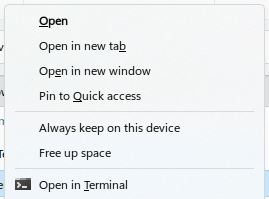

# Quick Setup Guides

Get yourself quickly set up so that your computer is more secure and safe.

Yes, this page is long.

_a) it's mostly cos of the screenshots;_

_b) internet safety is complicated!_

## Inside your computer

Read detailed information in the section dedicated to software inside your computer:


[inside-your-computer](inside-your-computer/)


### Firewall

_Learn more details on_ 📄[firewalls.md](inside-your-computer/firewalls.md "mention").



#### Choose a firewall application.

I recommend SimpleWall Download and Binisoft MalwareBytes Windows Firewall Control.

* Download [🌐SimpleWall](https://github.com/henrypp/simplewall)
* Download [🌐Binisoft MalwareBytes Windows Firewall Control](https://www.binisoft.org/wfc)

(I actually use both at the same time.)



#### Install the firewall.



#### Activate the firewall.

**SimpleWall firewall**

SimpleWall is fairly simple.

It allows you to block all of Microsoft's spying and telemetry on your computer.

<figure><figcaption></figcaption></figure>

I have it set to block ALL connections by default. Then it will pop up a notification each time an app/process tries to create a new connection.

<figure><figcaption></figcaption></figure>

Don't forget to click _**Enable filters**_!!! This activates the SimpleWall firewall.

<figure><figcaption></figcaption></figure>


I had some trouble with SimpleWall at first, I guess because the pop-up notifications weren't appearing 🤷

I allowed a bunch of system processes through the firewall at random (educated guesses) until the internet connection was working again.

Hopefully you won't run into this issue. If you do, search the internet for tips — you can probably find some guidance on [🌐 SimpleWall's intro guide](https://github.com/henrypp/simplewall) too.


**MalwareBytes firewall**

MalwareBytes firewall is not set to block everything by default.


Switch to the _Profiles_ tab and set it to **Medium Filtering (recommended)**.



Do not set it to High Filtering unless you want to completely sever your computer from the internet.


Also check the **Automatically set Medium Filtering after X minutes**.

<figure><figcaption></figcaption></figure>

Go to the _Notifications_ tab and set it to **Display Notifications**. This will ensure that you get a pop-up notification for every application (including system processes) that attempts to connect to the internet.

<figure><figcaption></figcaption></figure>

If you are concerned that some virus or malware might be connecting to the internet during boot-up, go to the _Security_ tab and enable **Secure Boot**.

<figure><figcaption></figcaption></figure>

Finally, return to the _Dashboard_ tab to check the firewall status — it should look like this:

<figure><figcaption></figcaption></figure>

And that should be enough!

I actually have both SimpleWall _and_ Binisoft MalwareBytes firewall running. I don't know if it's necessary, but it gives me some peace of mind knowing that every process has to get through _two_ firewalls in order to connect to the internet.



***

### Block OS Telemetry

We already achieved this with [🌐SimpleWall](https://github.com/henrypp/simplewall) in the [# Firewall section](quick-setup-guide.md#firewall).

_Learn more details on_ 📄[blocking-os-telemetry.md](inside-your-computer/blocking-os-telemetry.md "mention").

***

### Antivirus

_Learn more details on_ 📄[antivirus-apps.md](inside-your-computer/antivirus-apps.md "mention").



#### Choose an antivirus application.

I recommend Kaspersky and MalwareBytes.

I mainly recommend Kaspersky, but you need to keep creating a new account every 30 days, or you can just pay for it.

Windows Security does a decent job too, but it isn't perfect. Use it alongside another app.

* Download [🌐Kaspersky](https://www.kaspersky.com/downloads/standard-free-trial) [FREE TRIAL](#user-content-fn-1)[^1] — ([compare their plans](https://www.kaspersky.com/downloads#compare-table))
* Download [🌐MalwareBytes](https://www.malwarebytes.com/mwb-download)

Register for a Kaspersky account if you choose that. I do recommend it because it's the only antivirus app that managed to find the ransomware malware hiding in my RAM.



#### Install the antivirus software.

Kaspersky has a more-involved setup procedure because you have to sign in to your account.



#### Run the antivirus scans.

Most antivirus apps have a "quick scan" and a "full scan".

You should run both.

Start with the "quick scan" because that will scan the most likely locations that a virus is hanging out, and it will find it quickly if it is there.

Then run a "full scan". This will scan _everything_ but it will take _ages_.



#### Windows Security — double check it

If you are using Windows, go into your Windows Security application.

Double check your scan settings — one virus that I recently had had set Windows Security's antivirus scanning to exclude the entire system C: drive from its scans! The virus was able to go undetected because of this.

<figure><figcaption></figcaption></figure>

<figure><figcaption></figcaption></figure>

Your Exclusions list MUST look like this:

<figure><figcaption></figcaption></figure>



***

### Internet Connection Killswitch

_Learn more details on_ 📄[internet-connection-killswitch.md](inside-your-computer/internet-connection-killswitch.md "mention").

Some firewall and antivirus software have this functionality built in.

I haven't explored this yet; check back here soon to see what I've found. Or go research it for yourself ;)

***

## Between your computer and the Internet

Read detailed information in the section dedicated to Internet connectivity:


[internet-connectivity](internet-connectivity/)


### DNS Handler

_Learn more details on_ 📄[dns-to-get-around-blocks.md](internet-connectivity/dns-to-get-around-blocks.md "mention").

x

***

### WARP by CloudFlare

_Learn more details on_ 📄[warp-by-cloudflare.md](internet-connectivity/warp-by-cloudflare.md "mention").

d

***

### VPN for best privacy

_Learn more details on_ 📄[vpn-the-only-real-privacy.md](internet-connectivity/vpn-the-only-real-privacy.md "mention").

s

***

## Your activity on the Internet

Read detailed information in the section dedicated to your activity on the Internet:


[your-internet-activity](your-internet-activity/)


### Block Internet Telemetry

_Learn more details on_ 📄[block-internet-telemetry.md](your-internet-activity/block-internet-telemetry.md "mention").

f

***

### Social Media Privacy

_Learn more details on_ 📄[social-media-privacy.md](your-internet-activity/social-media-privacy.md "mention").

p

***

### Account Security — passwords etc.

_Learn more details on_ 📄[account-security-passwords-2fa-keys-etc..md](your-internet-activity/account-security-passwords-2fa-keys-etc..md "mention").

p

***

### Decentralized communications

_Learn more details on_ 📄[communication-networks](../decentralization/communication-networks/ "mention").

p

***

### Anonymized communications

_Learn more details on_ 📄[anonymized-communications.md](your-internet-activity/anonymized-communications.md "mention").

d

***

[^1]: Free trial for 30 days.

    You can keep creating new trial accounts by using Gmail's email aliases — simply put a + and a number after it in your gmail address: _hell&#x6F;**+kspsk01**@gamil.com_
