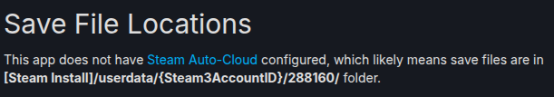

# Game Saves Syncing

I play using Steam but loads of games just don't have built-in save-file syncing. I have no idea why — Valve provide 100 MB game sync storage for each game (although, I don't know if this comes at a cost to the game developers or not).

My solution for this is to use Git to track and my game saves, and GitHub or GitLab to sync them.

I have only just started doing this, so I can't say if there are bugs and risks yet.

Of course, if you have already started the same game on multiple devices, then the first time you pull the newer GitHub file down onto your computer, there's going to be a file conflict. So, make sure you've checked which game save file has the most progress, otherwise you're gonna lose it!

GitHub Desktop does "automagic" git management, which really isn't recommended because then you don't really learn anything about how git works.

However, if you have no intention of using git for other things in the future — e.g., you're not a programmer — then I don't think it matters too much.

If you already have git installed and a GitHub (or similar) account, [skip to Step 4](game-saves-syncing.md#find-your-steam-games-save-file-location).



### Make a git account on a git sync service

You need to have a remote storage location to sync your git-controlled Steam save folder to.

I personally use GitHub, but there are controversies around them. If you decide to avoid GitHub, there is GitLab, and a bunch of other services. Do your own research so that you understand what you're signing up for!




### Install Git on your computer

I'm talking about **Git**, not about **GitHub**.

* **GitHub** is the cloud storage sync service for git-based file version tracking.
* **Git** is the software that tracks the changes each time you edit files.

The GitHub Desktop app does install git on your computer, but AFAIK[^1] it isn't accessible through the command line. Download and install the git software too, because you'll need to run it through the command line in a minute.




### \[Optional] Install GitHub Desktop (or similar)

This app is a graphical user interface (GUI) for setting up git repositories on your computer. It does things mostly automatically after you sign in to the app using your GitHub account. If you're using a different online sync platform, most git sync apps have the ability to connect to them too, but specialised features of each platform may not be available.

Install the app, sign into it with your chosen sync service account, then stop there — the next step has to be done in the command line.




### Find your Steam game's save file location

You can search for the game on SteamDB, a Most Excellent Website.

Here is the link to The Room 1 on SteamDB:



There is a section named "Cloud saves" or "Save file location":

<figure><figcaption></figcaption></figure>

So in your file browser, go to the root of your Steam installation and follow the folder address.

Once you are in the folder, copy the address from the file browser's address bar.




### Use your command line app

Ok! Don't be afraid! We're going `text based.`  &#x20;

Open your command line application.

* On Windows, this is "Terminal" or "CMD" or "Powershell".
  * _(Actually, the new Terminal app is just a wrapper for CMD and Powershell.)_
* On Linux, well if you're using Linux then you've certainly opened this already.
* On macOS, actually sorry I'm not rich enough for Apple. You'll work it out.

Now type `cd` and paste the folder address that you just copied, with <kbd><mark style="color:red;">Shift<mark style="color:red;"></kbd>+<kbd>Ctrl</kbd>+<kbd>V</kbd>.&#x20;

Press <kbd>Enter</kbd>.




### Do _git_ things

Now we're gonna make git track your game save files.

First, type `git init` and press enter, to "initialise" the folder. This sets up file version tracking.

Second, type `git add .` and press enter. The `.` means "all files". This adds all files of that folder to the tracking.

Third, type `git commit -m "Initial commit"` and press enter. This creates a "commit", that is, an item that says "the current version of these files is ready to be uploaded". Note that _no upload is taking place right now_ — we have simply created a note about a version of the files, like writing a request to someone.

Next, we could sync the git commit to your GitHub repository, but this involves a bunch of words which are pretty confusing because it requires you to understand the naming of branches and meaning of words which might not be so intuitive. So let's use a GUI app instead:




### Use GitHub Desktop (or similar)

* Click <kbd>File</kbd> in the menu bar and choose "Add local repository".
* Paste the same folder address again and click "Add repository".
* Fill in the boxes, such as repository name and description. Choose if you want to keep it private or not. (It's a game save file so probably keep it private. _Note that some git sync platforms only allow private repositories if you pay for an account._)
* Click "Publish repository".



And that's it!&#x20;

Ok it's not, you have to set it up on your other Steam machines too, but at this time I haven't done that so I can't write a guide. I'm sure you can work it out though, if you've got this far.

Also you might wanna set it up to automatically sync x-minutes after the game ends, or something like that, especially if you're using a SteamOS installation cos the whole point of SteamOS and SteamBox and SteamDeck is that you treat it like a normal gaming console, so you don't really wanna be opening GitHub and/or running terminal commands all the time!

I'll do my own research into that soon and add a guide here for you then.

Happy gaming and syncing!

[^1]: as far as I know
