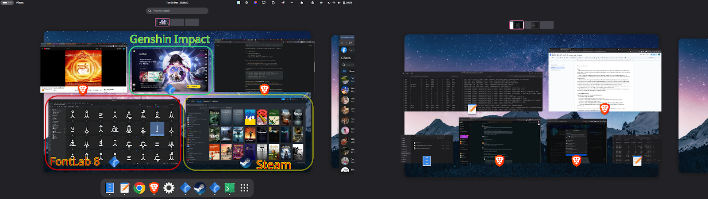

# Wanna move to Linux?

<figure><figcaption>
<em>A screenshot, showing Steam, FontLab 8, Genshin Impact, and some desktop apps including Files, Text, Brave.</em>
</figcaption></figure>

## Why?

* Windows is spyware, malware, designed to run viruses, it’s chocka full of tracking, telemetry, forced updates, forced laptop wakes in the night, forced AI/LLM integration, shitty updates (e.g. File Explorer is worse than in Win10, new Paint is horrible to use), etc.&#x20;

_it does what I tell it to do:_

* When I'm using my computer, I know that it's only doing what I asked it to. It's not doing secret ​updates, it's not reporting my behaviour to a big daddy company, and when I turn it off, it's off, and it's not gonna wake itself up unless I've programmed it to.

_we've become computer-illiterate:_

* We've been lured into using computers & phones without the faintest inkling of really how to set up, configure and control our very own devices. By this point, they hardly even belong to us. Linux is a bit more DIY and that's a good thing because it'll help you learn more about computers and how to maintain and control them. Really it's something we should know, otherwise we're living at the whim of whichever company and govt currently controls our devices.

_it runs well on old and weak hardware:_

* I set up a very old laptop for my friend recently, it couldn’t even run Windows 10 properly, dual core, 4GB RAM. Now it’s usable, he’s been using it for a few weeks for job hunting and studying programming.
* Forced hardware obsolescence — did you know that, with Microsoft’s new hardware requirements coming very soon, Microsoft are about to make 34239487625 computers into junk?!

 

## Is it suitable for me?

If you answer yes to most or all of these, then absolutely!

* You mostly use the web browser
* You used to use a Chromebook and it was enough for you
* You never or occasionally use MS Office, or just use it for simple things like editing basic documents
* You don’t use Photoshop (and other Adobe stuff)
* You don’t use CAD. (Actually there are CAD solutions but most CAD workers need to abide by their corporation's requirements. Hopefully there’ll be more CAD stuff in the near future as Valve’s efforts with graphics and de-coupling from Microsoft pay off and spread into the other communities.
* You’re a curious and adaptable person who wants to escape the clutches of the Behemoth Corporations (proto-skynet)


It's not gonna be the smoothest of sailing as things usually/sometimes are on Windows, but giving up "perfect" convenience is the price to escape the Eye of Sauron.


## Software and alternative apps

* **Video editing**: DaVinci Resolve & Studio run natively. There are other video apps too.
* **3D**: Blender runs natively. New updates are bringing CAD-like functionality.
* **Graphic design**:&#x20;
  * Canva and Figma are web-based and work pretty well (I’m still trying to get local fonts to work in Figma).
  * Photoshop doesn’t run but I’m experimenting with it in Steam’s Proton layer.
  * GIMP is horrible and basically trash.&#x20;
  * There are other apps too. Krita (raster), Inkscape (vector), etc.&#x20;
  * If your workflow doesn’t depend on Photoshop etc then research the graphic apps and test them out. Note that their performance may be worse on Windows due to unoptimised graphic rendering.
* **Fonts**: FontForge is shit but I got FontLab 8 running flawlessly.
* **Office**: MS Office 365 is web-based. LibreOffice does work but has some weaknesses. WPS Office is fairly good and is updated often. Google Docs works of course.
* **Cloud storage**: ok, this is a pain point.&#x20;
  * I've found no official client for Google Drive, MS OneDrive, or even Proton Drive (???)
  * Unofficial cloud service sync clients. Usually these are paid-for services, or an absolute nightmare to set up. InSync is one that I used years ago in its early alpha days. Now it is a paid app, which I haven't used yet.
  * Built-in features in the file browsers to connect to cloud services. These aren't excellent, they don't seem to provide a synced/cached copy of the files or the directory structures. Some apps can't seem to access files from them.
  * Google _obviously_ have a Linux client for Google Drive internally, but just won't release it for the public to use. Utterly infuriating. It's built in to ChromeOS and the Android app. And their entire company is built on top of Linux, they even have their own internal version of Ubuntu, "Goobuntu". So there's obviously a Linux client for Google Drive. But we can't have it. 🖕&#x20;


[google-drive-access](making-it-work/google-drive-access/)


## Hardware

* CPU: old and new, still supported. Newer architectures have faster code (x64v3).
* TCM: not required. (TCM is the "Trusted Computing Module", a "security" chip. Forced by Uncle Microsoft)
* RAM: lower requirements.
* Performance: smoother and faster even on older hardware.
* Webcam: sometimes not perfect but it works.
* Audio: also sometimes not perfect, especially with certain laptop speakers. But audio itself is fine, especially if you use headphones or an external speaker.
* HDMI: no problems. (I haven't tested DisplayPort but afaik no problems.)
* GPU: usually no problems. Nvidia is most problematic, but I have Nvidia with Optimus (the most problematic) and even mine is fine. (Issues tend to be with newer Nvidia chips, because Nvidia don’t open-source their driver code. AMD do.)
* Touchpad: ok, i had a fight with this but a) it works, b) there are solutions for scroll speed, and c) it looks as if the whole situation is getting resolved in some soon-to-arrive updates.

## OS features

Honestly I think Linux can do nearly everything Windows does. There’s sometimes a bit more manual setup involved for some things, but once it’s set up, if you don’t fiddle around, it is usually fine.

* Dark mode
* All basic productivity apps
* Smooth window management&#x20;
  * (way smoother than Windows, although currently lacking some basic gesture features)&#x20;
  * (Sometimes it feels smoother than MacOS too. It's certainly nowhere near as heavy.)
* A variety of desktop shells to meet your needs and preferences, with lots of customisation, themes, visual effects, whatever.&#x20;
  * Gnome has a few issues which annoy me, and they’re solved in KDE Plasma, but there are other issues in Plasma that I can’t deal with.&#x20;
  * Gnome seems a bit too bare, but there are a lot of extensions with which you can completely customise your desktop experience.&#x20;
  * Overall I prefer Gnome, but I’m waiting for the day that KDE resolves those issues.&#x20;
  * I’m also looking forward to COSMIC shell.&#x20;
  * There are a bunch of others too. Some are more limited & polished, others are more raw and wildly customisable — you can design a desktop straight out of Minority Report.
  * Changing desktop shell is almost like changing between Windows and Mac, but if you try a few, you’ll start to realise the difference between “OS” and “desktop environment”.
* **Usability**. Ok so the UI is different to Windows and Mac. There are gonna be a few teething issues to overcome. There are also some tradeoffs to make when choosing a desktop shell.&#x20;
* **Package management**: there are pros and cons to the Linux method, but the good news is that nowadays we have the best (and the worst) of both worlds! Ok I’ll stick this part at the end, it’s boring.&#x20;
* **Virtualisation**: Linux is perfect for running virtual machines. There are new features coming soon (VFIO) which provide bare metal GPU access to the guest machine e.g. Windows. Actually, this is already possible, but hardware support is slim (specific) and there are challenges getting it working correctly. (Don’t bank on this until there is solid news about it.)

## Gaming

Valve have made major efforts with Steam, Wine & Proton (not Proton VPN), a compatibility layer that bridges the gap between Windows apps and Linux. Most AAA games run well on Linux nowadays, sometimes even with better performance.&#x20;

I can actually run Genshin Impact on Linux from an external SSD, which isn’t even supported by Steam; it’s basically native performance, the entire game runs normally, and the CPU+GPU don’t even get as hot as in Windows.

You can search for your game on Steam (or [SteamDB](https://steamdb.info/)) to see if it has SteamOS support — if so, that means Linux.&#x20;

If it’s not on Steam, look on [ProtonDB](https://www.protondb.com/), or just search Brave/Google/Reddit/etc to see if anyone else has tried. If it’s a popular game, there’s likely to be people talking about it. Actually, in the nerdcore gamer community, there’s now massive interest in custom builds of Linux gaming rigs, fine-tuned for performance, built as PCs or as consoles. (Check: Garuda, CachyOS, Bazzite, Nobara, etc.)

## Windows apps

You can utilise Steam’s Proton layer & ProtonTricks to make many Windows apps work.&#x20;

* I got FontLab 8 working flawlessly.&#x20;
* Apps like MS Office and Photoshop can be made to work, but the effort and challenge is pretty high and I haven’t succeeded on my current Linux OS. But actually I haven’t exhausted the methods — I haven’t yet tried using an installer.

MS Office actually has an [online version](http://office.com/) which may well meet all your basic needs, as long as you’re not needing MS Office for most of your daily work. I use PowerPoint for my employer, but luckily the online PowerPoint actually supports dual-screen presentation mode, so I don’t even need to install MS Office any more.

(Alternative office suites are just not up to par, but if they meet your needs then they may be ok too. WPS Office is quite good but does have some bugs and it is a marketing funnel from KingSoft. LibreOffice is still atrocious. Idk what happened to OpenOffice. Zoho i haven’t tried yet.)


[windows-applications](functional-things/windows-applications/)


## Web browsers

All of them are available except Safari and a few random startup project browsers who don’t love their users. (I mean, anyone who truly loves someone also wishes for them to be free! Fundamental principle.)

If you want sync between desktop and mobile, your options are:

* ~~<mark style="color:red;">Google Chrome</mark>~~ (don’t do it! Escape the Goog!)
* ~~<mark style="color:red;">Edge</mark>~~ (but really do you want MS crud on your devices)
* <mark style="color:green;">**Brave**</mark> \[[website](http://brave.com/download/)] (questionable background ethics but it’s the only other syncing app)

Browser extensions: basically all of them work the same as in Windows. My main ones are:

* [ublock origin lite](https://chromewebstore.google.com/detail/ddkjiahejlhfcafbddmgiahcphecmpfh)&#x20;
* [Dark Reader](https://chromewebstore.google.com/detail/dark-reader/eimadpbcbfnmbkopoojfekhnkhdbieeh) (automated dark mode for all websites)
* [google translate popup](https://chromewebstore.google.com/detail/aapbdbdomjkkjkaonfhkkikfgjllcleb)&#x20;
* [youtube unhook](https://chromewebstore.google.com/detail/khncfooichmfjbepaaaebmommgaepoid) (hides distracting crap on youtube's interface)
* [YouTube NonStop](https://chromewebstore.google.com/detail/nlkaejimjacpillmajjnopmpbkbnocid) (stops youtube from pausing to check if you're still there)

## Messaging

Most messenger platforms have website versions which are probably good enough already and you can limit their permissions more than you can with an app, i.e. you would be better off using a web app than an installed app.

* Telegram: official desktop app. — [desktop.telegram.org](https://desktop.telegram.org/) or install from your Linux package manager&#x20;
* Signal: official desktop app — [signal.org/download/linux](https://signal.org/download/linux/)&#x20;
* Zalo: web app, works fine as an “installed web app” — [chat.zalo.me](https://chat.zalo.me/)&#x20;
* WhatsApp, Facebook, Instagram, etc. — just use the web browser. There are unofficial desktop apps but honestly I didn't find any of them to be worth using.

## Security

* VPNs are just as usable on Linux as on other platforms. Many VPN service providers provide Linux apps, and if not, you can just use the VPN details in the in-built VPN settings in the computer.
* Password managers: most have native or Electron apps for Linux. I use Proton and BitWarden.
* 2FA/TOTP authenticator apps: some exist for Linux already. Gnome has one and Proton has one. I think BitWarden does too.

## Keyboard

* IMEs (Input methods):
  * I’m using Fcitx5 as a container for UniKey (for Vietnamese), which can also host other IMEs.&#x20;
  * I haven’t yet got Japanese or Korean working, but I haven’t really tried yet.&#x20;
  * I’ll explore IMEs for the Complex Script languages over the next few weeks.&#x20;
  * Fcitx is one of the most popular solutions currently, and it seems to be supported by more developers than the official apps like ibus.
* Custom keyboard layouts: rarely necessary, but I’ve learned how to make them. I can make them for you.




[input-methods-fcitx5-asian-languages.md](making-it-work/keyboard/input-methods-fcitx5-asian-languages.md)





[custom-keyboard-layouts.md](making-it-work/keyboard/custom-keyboard-layouts.md)




## Package management

There are pros and cons to the Linux method of managing software packages, but the good news is that nowadays we have the best (and the worst) of both worlds!&#x20;

So, the basic idea of package management in Linux is that there is one package on the computer and any app that needs that package will utilise the same one. Great! No more wasted space by duplicating code. This means that apps are generally smaller, and download and install faster.&#x20;

Also, all the apps’ code is stored in an official repository that is fully open source and checked when it is compiled and uploaded, so there’s little-to-zero chance of there being any viruses or malware in them.&#x20;

A downside is that sometimes multiple versions of the same package need to be installed. Sometimes the package manager handles this fine, but sometimes it cannot. Usually it doesn’t matter because the app maintainers will release an update soon anyway.&#x20;

But there are also entirely new app distribution models that circumvent such issues, including FlatPak and another good one and also Snaps but i hate them.

***

admin links

[🔏 my google docs source file](https://docs.google.com/document/d/1rZpQ9Bp4ZZGv9EJcSzL9LIpesHTLeVHkcNcVb0Yfwy8/edit?tab=t.0)&#x20;

[🖊️ my facebook post](https://www.facebook.com/FarranDeTao/posts/pfbid0VsDfq6Bnrypt74pgnMK1NgH4G7m2uTTxJeMTZUre7cwXu2m614aJTQi6Q9KbtpUnl)&#x20;

