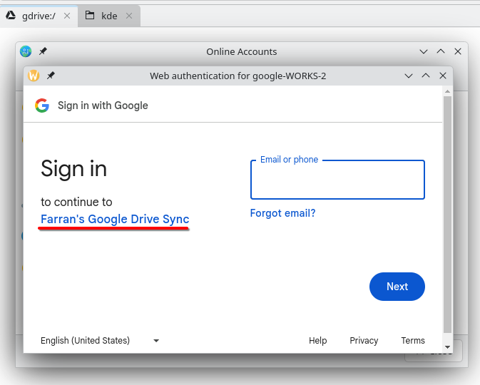

# GNOME...

So...&#x20;

You may have noticed that _most_ of my gripes listed on the previous page are actually about GNOME...

You may be surprised to learn that I'm not alone in this struggle.

For the past several years, nearing on a decade (or perhaps 15 years?), the GNOME team has become progressively weirder. You could describe them as somewhat fascist, if we're being honest.

Here's a great article outlining a bunch of the stuff they've done:



I'll put a list of gripes here which are solved simply by _**not using GNOME**_.

* well i haven't tried other DEs yet so I can't compare them
* but probably you can avoid them all just by using KDE or Hyprland, let's be honest
* gnome applications screen doesn't have any broader overview, so reorganising apps into screens and folders on those screens is a giant ballache
* _UI-UX consistency of expected behaviour_ gets broken _**all the time**_.&#x20;
  * Clicking down on a window button doesn't activate it: that's right.&#x20;
  * If you decide you don't want to click a button, what do you do?&#x20;
  * That's right, you drag the mouse away from the button before you release the mouse button.&#x20;
  * Guess what happens in GNOME apps?
  * Your drag is converted into a _window-moving drag_. That means that there's no way to deselect the window button without having a different side effect. It also means that the entire paradigm of _deselecting-an-already-half-clicked-button_ is now broken.
  * :clown:

## examples

<figure><figcaption>
arch wiki / fcitx5 / <a href="https://wiki.archlinux.org/title/Fcitx5#GNOME">usage #gnome</a> 
</figcaption></figure>

