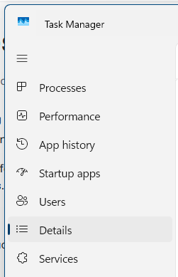

# Quick Setup Guide

Get yourself quickly set up so that your computer is more secure and safe.

Yes, this page is long.&#x20;

&#x20;  _a) it's mostly cos of the screenshots;_&#x20;

&#x20;  _b) internet safety is complicated!_

## Inside your computer

### Firewall

_Learn more details on_ 📄[firewalls.md](firewalls.md "mention").&#x20;



### Choose a firewall application.

I recommend SimpleWall Download and Binisoft MalwareBytes Windows Firewall Control.

* Download [🌐SimpleWall](https://github.com/henrypp/simplewall)&#x20;
* Download [🌐Binisoft MalwareBytes Windows Firewall Control](https://www.binisoft.org/wfc)&#x20;

(I actually use both at the same time.)



### Install the firewall.




### Activate the firewall.

#### SimpleWall firewall

SimpleWall is fairly simple.&#x20;

It allows you to block all of Microsoft's spying and telemetry on your computer.

<figure><figcaption></figcaption></figure>

I have it set to block ALL connections by default. Then it will pop up a notification each time an app/process tries to create a new connection.

<figure><figcaption></figcaption></figure>

Don't forget to click _**Enable filters**_!!! This activates the SimpleWall firewall.

<figure><figcaption></figcaption></figure>


I had some trouble with SimpleWall at first, I guess because the pop-up notifications weren't appearing 🤷&#x20;

I allowed a bunch of system processes through the firewall at random (educated guesses) until the internet connection was working again.&#x20;

Hopefully you won't run into this issue. If you do, search the internet for tips — you can probably find some guidance on [🌐 SimpleWall's intro guide](https://github.com/henrypp/simplewall) too.


#### MalwareBytes firewall

MalwareBytes firewall is not set to block everything by default.


Switch to the _Profiles_ tab and set it to **Medium Filtering (recommended)**.



Do not set it to High Filtering unless you want to completely sever your computer from the internet.&#x20;


Also check the **Automatically set Medium Filtering after X minutes**.

<figure><figcaption></figcaption></figure>

Go to the _Notifications_ tab and set it to **Display Notifications**. This will ensure that you get a pop-up notification for every application (including system processes) that attempts to connect to the internet.

<figure><figcaption></figcaption></figure>

If you are concerned that some virus or malware might be connecting to the internet during boot-up, go to the _Security_ tab and enable **Secure Boot**.&#x20;

<figure><figcaption></figcaption></figure>

Finally, return to the _Dashboard_ tab to check the firewall status — it should look like this:

<figure><figcaption></figcaption></figure>

And that should be enough!

I actually have both SimpleWall _and_ Binisoft MalwareBytes firewall running. I don't know if it's necessary, but it gives me some peace of mind knowing that every process has to get through _two_ firewalls in order to connect to the internet.



***

### Block OS Telemetry

We already achieved this with [🌐SimpleWall](https://github.com/henrypp/simplewall) in the [# Firewall section](quick-setup-guide.md#firewall).&#x20;

***

### Antivirus

_Learn more details on_ 📄[antivirus-apps.md](antivirus-apps.md "mention").&#x20;



### Choose an antivirus application.

I recommend Kaspersky and MalwareBytes.

I mainly recommend Kaspersky, but you need to keep creating a new account every 30 days, or you can just pay for it.

Windows Security does a decent job too, but it isn't perfect. Use it alongside another app.

* Download [🌐Kaspersky](https://www.kaspersky.com/downloads/standard-free-trial) [FREE TRIAL](#user-content-fn-1)[^1] — ([compare their plans](https://www.kaspersky.com/downloads#compare-table))&#x20;
* Download [🌐MalwareBytes](https://www.malwarebytes.com/mwb-download)&#x20;

Register for a Kaspersky account if you choose that. I do recommend it because it's the only antivirus app that managed to find the ransomware malware hiding in my RAM.



### Install the antivirus software.

Kaspersky has a more-involved setup procedure because you have to sign in to your account.



### Run the antivirus scans.

Most antivirus apps have a "quick scan" and a "full scan".&#x20;

You should run both.

Start with the "quick scan" because that will scan the most likely locations that a virus is hanging out, and it will find it quickly if it is there.

Then run a "full scan". This will scan _everything_ but it will take _ages_.



### Windows Security — double check it

If you are using Windows, go into your Windows Security application.

Double check your scan settings — one virus that I recently had had set Windows Security's antivirus scanning to exclude the entire system C: drive from its scans! The virus was able to go undetected because of this.&#x20;

<figure><figcaption></figcaption></figure>

<figure><figcaption></figcaption></figure>

Your Exclusions list MUST look like this:

<figure><figcaption></figcaption></figure>



***

## Between your computer and the Internet

### Internet Connection Killswitch

Some firewall and antivirus software have this functionality built in.

I haven't explored this yet; check back here soon to see what I've found. Or go research it for yourself ;)&#x20;

***

### DNS Handler

x

***

### WARP by CloudFlare

d

***

### VPN for best privacy

s

***

## Your activity on the Internet

### Block Internet Telemetry

f

***

### Personal Profile Privacy

p

***

### Account Security — passwords etc.

p

***

### Decentralized communications

p

***

### Anonymized communications

d

***

[^1]: Free trial for 30 days.

    You can keep creating new trial accounts by using Gmail's email aliases — simply put a + and a number after it in your gmail address: _hell&#x6F;**+kspsk01**@gamil.com_
