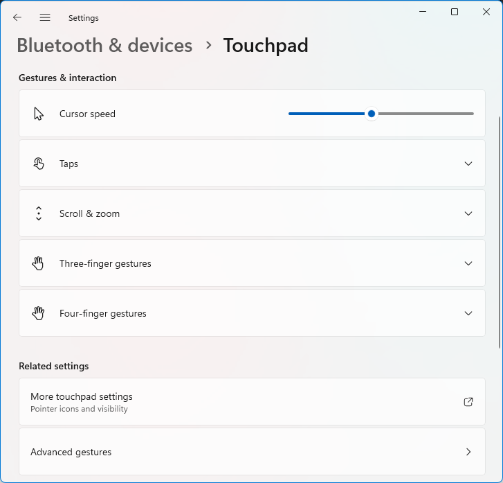

# My setup (Windows)

I have customized my touchpad gesture shortcuts entirely in Windows. You can achieve this in both Windows 10 and Windows 11. The gestures are not identical to MacOS — actually, we can do some actions that aren't even possible in MacOS — but the gestures are intuitive and more useful than the default Windows gestures.

First of all you need to open the [Windows **Settings** app](ms-settings:devices-touchpad). Go to **Bluetooth & devices**, and choose **Touchpad**. In the **Related settings** section, choose **Advanced gestures**.

<figure><picture><source srcset="../.gitbook/assets/image (1).png" media="(prefers-color-scheme: dark)"></picture><figcaption></figcaption></figure>

## Three-finger gestures

Expand the **Configure three-finger gestures** section. From each drop-down list, you can choose from an array of options, or you can choose **Custom shortcut** if you want to use your own keyboard shortcut.

I am used to three-finger tap for "middle click", which has been standard functionality in Linux forever.

I also set the three-finger swipes to activate the window snapping shortcuts:

* `🪟`+`⬆️` on swipe up, to maximize a window,
* `🪟`+`⬇️` on swipe down, to restore/minimize a window,
* `🪟`+`⬅️` on swipe left, to snap a window to the left,
* `🪟`+`➡️` on swipe right, to snap a window to the right.

_It is better to use **custom shortcut** for these functions than to use the in-built options from the lists._

<figure><picture><source srcset="../.gitbook/assets/image (2).png" media="(prefers-color-scheme: dark)"></picture><figcaption></figcaption></figure>

Combining any of these swipes with pressing the `Alt` key will also trigger the associated window function:

* `🪟`+`Alt`+`⬆️` on swipe up, to snap a window to the top half of the screen,
* `🪟`+`Alt`+`⬇️` on swipe down, to snap a window to the bottom half of the screen,
* `🪟`+`Alt`+`⬅️` on swipe left, to snap a window to a third of the screen and move it to the left,
* `🪟`+`Alt`+`➡️` on swipe right, to snap a window to a third of the screen and move it to the right.

## Four-finger gestures

Expand the **Configure four-finger gestures** section. From each drop-down list, you can choose from an array of options, or you can choose **Custom shortcut** if you want to use your own keyboard shortcut.

I have the four-finger tap set to open the **Notification centre**, but to be honest I rarely use this and instead use `🪟`+`N`. (Actually I use my own custom shortcut, set to `🪟`+`A` for reachable position.)

* **Swipe up**: set to Task view or Switch apps. With Switch apps, you can keep your fingers on the touchpad and slide around to select the window that you want to switch to.
* **Swipe down**: set to Volume down. This is very useful if you are regularly connecting your computer to screens & speakers and giving presentations, because maybe you will suddenly need to turn the volume down quickly. _Swiping down even a tiny bit activates the volume control, so you can also use this to turn the volume up._
* **Swipe left & right**: I have these set to switch desktops, because multiple desktops is hardwired into my computer usage from back in my Linux days. (I don't use multiple desktops very much any more.) You could also use these to skip to the next or previous track, but you have to record the custom shortcut as a _keyboard_ shortcut, so you need to have track-skip keys or have configured custom keyboard shortcuts via software such as PowerToys (which does have a habit of sometimes deactivating itself so this is not 100% foolproof).

<figure><picture><source srcset="../.gitbook/assets/image (5).png" media="(prefers-color-scheme: dark)"></picture><figcaption></figcaption></figure>

