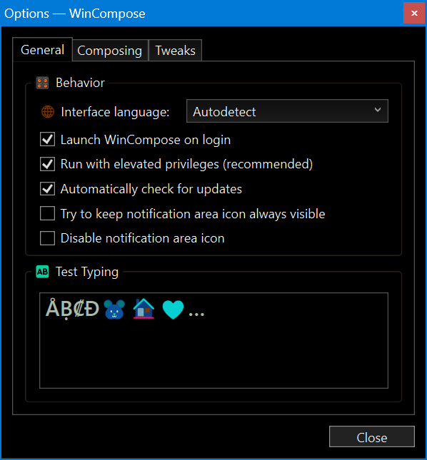

# WinCompose


This software is for Windows.&#x20;

This functionality is built in to Linux already.&#x20;

MacOS features something similar but I don't know anything about it.


WinCompose GitHub repository:



Website at [https://wincompose.info/](https://wincompose.info/)&#x20;



## Custom input sequences

You can create custom sequences too.

E.g. I use the ɲ symbol for the palatal nasal sound when typing IPA[^1], but WinCompose doesn't include it. Therefore, I've set the sequence <kbd>n</kbd> + <kbd>j</kbd> to output <kbd>ɲ</kbd>.

To set this up, open your file browser, paste this into the address bar: `%USERPROFILE%` and press <kbd>Enter</kbd>.

That will take you to the main folder of your username.

Here, you may create a plaintext file named `.XCompose` — or edit it if it already exists.

A custom input sequence should be written as such:

```xml
# <Multi_key> <key>… : "resulting text"
```

There is a setting in WinCompose that allows you to type a sequence in the wrong order and it will still output the intended symbol as long as there isn't another symbol for that order. Sometimes you might _not_ want this setting turned on, so to handle this manually, you can add the custom sequence with both orders.

Here is my custom input sequences — I only have 3 custom symbols:

```xml
<Multi_key> <n> <j> : "ɲ"     # enye spanish IPA    n+j
<Multi_key> <j> <n> : "ɲ"     # enye spanish IPA    j+n

<Multi_key> <N> <N> : "Ñ"     # Enye spanish letter N+N
<Multi_key> <N> <n> : "Ñ"     # Enye spanish letter N+n
<Multi_key> <n> <n> : "ñ"     # enye spanish letter n+n
```

The first two are for the same symbol — <kbd>ɲ</kbd> — and the next three are for <kbd>Ñ</kbd>
&#x20;and <kbd>ñ</kbd>.&#x20;

If you are creating sequences for uppercase letters, remember to include a version that allows you to mistakenly press one of the keys as the lowercase letter! E.g., for <kbd>Ñ</kbd>, we have <kbd>N</kbd>+<kbd>N</kbd> and <kbd>N</kbd>+<kbd>n</kbd>.


Your newly defined sequences don't take effect until after you've restarted WinCompose.



## My personal settings

_Press on each image to view it larger._

<div><figure><figcaption></figcaption></figure> <figure><figcaption></figcaption></figure> <figure><figcaption></figcaption></figure></div>

#### General

* [x] Run with elevated privileges — This allows you to use WinCompose in apps that are running as Adminstrator.

#### Composing

* Compose key: <kbd>**Insert**</kbd> — Set your own key. Insert is rarely used for anything, and the default key <kbd>Scroll Lock</kbd> is disappearing from modern keyboards. You can set two keys if you want!
* Keyboard LED: <kbd>**Caps Lock**</kbd> — The Caps Lock key's LED light will light up while WinCompose is still waiting for you to type (if it has one).

- [ ] Maintain original compose key behaviour — I have this disabled, but it is especially useful if you are using a key like AltGr as your compose key and if you need AltGr for other functions like keyboard shortcuts.

#### Tweaks

* [x] Fall back to case-insensitive matches — useful for if you type a sequence using a capital letter by accident and there is no uppercase symbol for that sequence.
* [x] Try to swap the two keys — For example, if you type <kbd>e</kbd>+<kbd>a</kbd> instead of <kbd>a</kbd>+<kbd>e</kbd>, it will still give you <kbd>æ</kbd>.
* [ ] Discard all typed characters — If you type a sequence that doesn't exist in WinCompose, it will release them into your text space. If you enable this setting, it won't output them anywhere, they will just vanish. It's usually better to keep this setting disabled, in case you press your Compose key by accident!

Inside the WinCompose Options window on your computer, you can hover the mouse over any setting and it will give you a popup with more information.

[^1]: [International Phonetic Alphabet](https://en.wikipedia.org/wiki/International_Phonetic_Alphabet)&#x20;
