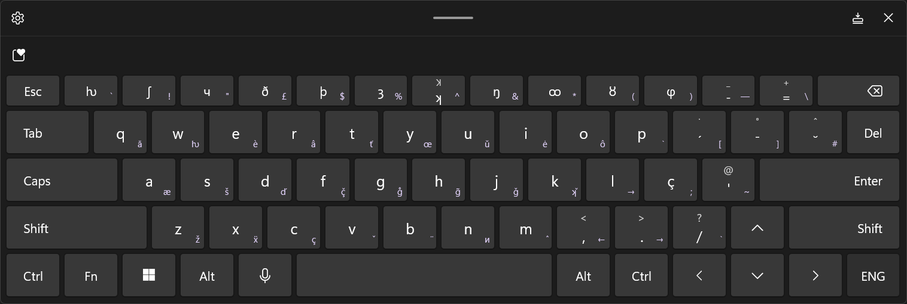
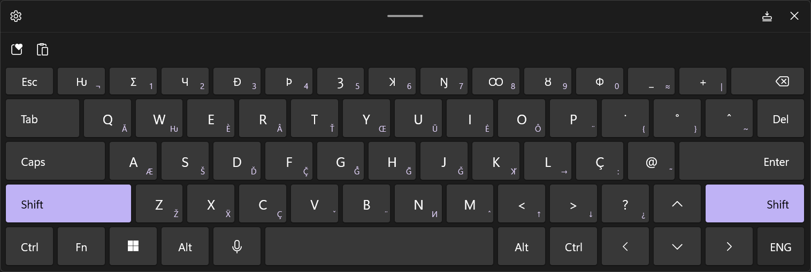
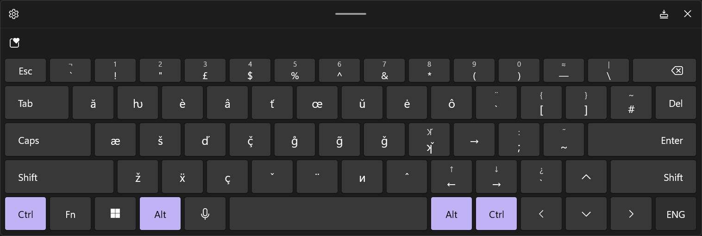
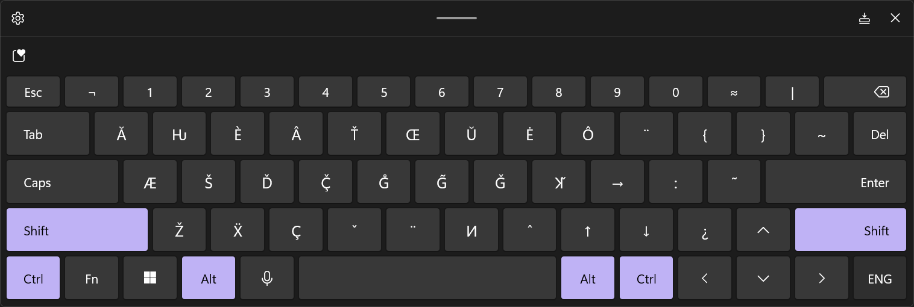

# Custom Keyboard Layouts


_Visit my_ [_GitHub keyboard layouts repo_](https://github.com/fazzaan/keyboard-layouts) _to download the latest releases._


I have four main custom keyboard layouts:

1. QWERTY UK English with IPA symbols
2. QWERTY UK for English with NewEng Alphabet
3. IPA for English laid out topographically (no English alphabet)
4. QWERTY for Vietnamese with NewVin Alphabet (development suspended)

***

## English for NewEng Alphabet

This keyboard is the standard QWERTY UK layout with additional glyphs added for my NewEng alphabet, including 15 new letters and 9 diacritics.&#x20;


Visit the [→ 🔗 GitHub repo](https://github.com/fazzaan/keyboard-layouts/releases/tag/NEv6.6) to download it.


<mark style="color:yellow;">**The new letters overtake the number row**</mark>, which is somewhat cumbersome for inputting numbers, so you either need a numpad on your keyboard or you need to switch back to a regular keyboard layout to input numbers. You can also access numbers via `Alt Gr + Shift`. In the future I may make a version that repurposes the F-keys as numbers.&#x20;

Click between the tabs to see each of the four key layers.



<figure><figcaption></figcaption></figure>



<figure><figcaption></figcaption></figure>



<figure><figcaption></figcaption></figure>



<figure><figcaption></figcaption></figure>



***

## English with IPA symbols

This keyboard is the standard QWERTY UK layout with additional glyphs added for IPA phonemes and symbols, plus a few other useful symbols.


Visit the [→ 🔗 GitHub repo](https://github.com/fazzaan/keyboard-layouts/releases/tag/EngIPAv13) to download it.


This version uses "deadkeys", which enable you to type two keys and output a singular unicode glyph, which reduces character count — useful for things like BlueSky and other character-limited social media platforms. However, deadkeys are infuriating to use, so I will publish an alternative version with no deadkeys in the near future. _This current version will probably be the last version with deadkeys._&#x20;

The latest version at time of writing is version 13.0.

<figure><figcaption></figcaption></figure>

#### IPA glyphs

| Glyph | Modifier       | Key |
| ----- | -------------- | --- |
| a     | Alt Gr         | q   |
| ɑː    | Alt Gr + Shift | q   |
| etc   |                |     |
|       |                |     |
|       |                |     |

#### Other useful symbols

| Symbol | Modifier                            | Key                                        |
| ------ | ----------------------------------- | ------------------------------------------ |
| →      | 
Alt Gr

Alt Gr + Shift 
 | 
> 

L  (for compat. with Word)
 |
| ←      | Alt Gr                              | <                                          |
| ↓      | Alt Gr + Shift                      | >                                          |
| ↑      | Alt Gr + Shift                      | <                                          |
|  —     | Alt Gr + Shift                      | -                                          |
| ≈      | Alt Gr + Shift                      | =                                          |
| etc    |                                     |                                            |

***

## Topographic IPA keyboard layout

This layout is designed purely for typing IPA symbols for English.&#x20;

The full Latin alphabet is available on the Alt Gr layers, but this is cumbersome to type in so the alphabet is only there for ease of typing a couple of letters when necessary.


Visit the [→ 🔗 GitHub repo](https://github.com/fazzaan/keyboard-layouts/releases/tag/TopoIPAv1.1) to download it.


#### Layout

Phoneme placement is as such:

* **Consonants** on the left side, **vowels** on the right (inspired by Korean Hangeul 2-Bulsik layout)
* **Unvoiced consonants** on base layer
* **Voiced consonants** on `Shift` layer
* **Monophthong vowels** on base layer
* **Diphthong vowels** (and a few monophthongs) on `Shift` layer
* **IPA symbols** around the edges, mostly on the right side ( `ː ˈ ˌ ˘ ͜ ⟨ ⟩` )
* Phonemes are arranged topographically, i.e. according to physical position in the mouth.

<figure><picture><source srcset="../.gitbook/assets/keyboard layout pretty IPA UK topographic - dark bg.png" media="(prefers-color-scheme: dark)"></picture><figcaption></figcaption></figure>

This layout isn't really ideal for general usage — instead, it has been created with futuristic keyboards in mind. One day in the perhaps-near future, LED display tech will be so cheap and ubiquitous that even our keyboard keys will have screens. In such a world, changing keyboard layouts will change the letters & symbols that are displayed on the keyboard keys' screens. With visual cues, it will be much easier to change between different layouts. Indeed, this has been an issue that I've used to constrain my other keyboard designs, to ensure that new users can find & remember the locations of additional glyphs with relative ease, which I've placed somewhat intuitively.

